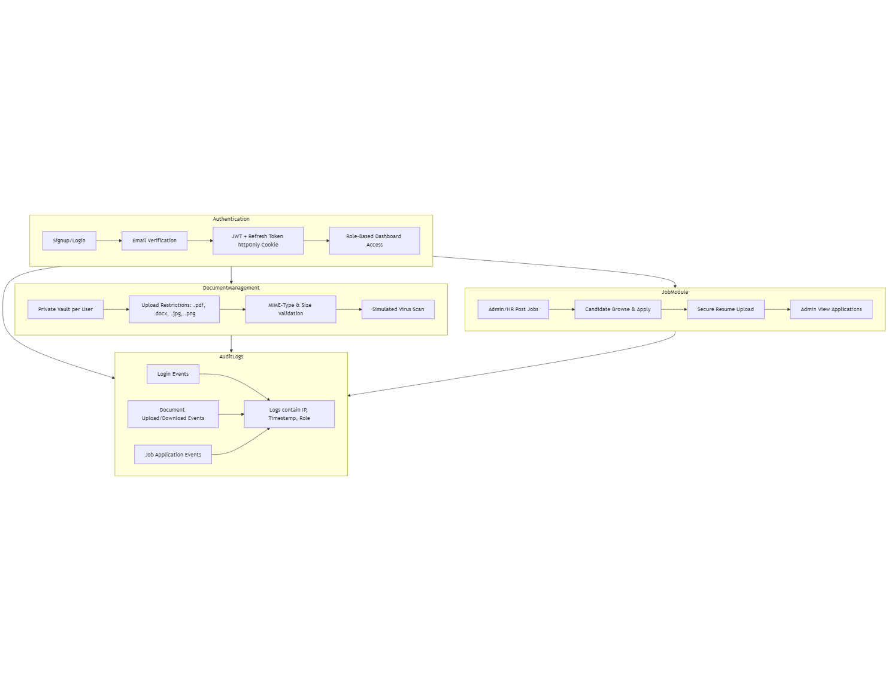

# 🔒 Secure Job Portal

A full-stack **secure job portal** built with **React JS, Redux Toolkit, Node.js,Mongo DB and Firebase Storage**, featuring secure document management, role-based access, and advanced security practices.  

This project was developed with a focus on **authentication, data protection, and compliance-grade security practices** for a production-ready experience.  

---

## 🚀 Live Demo
### ***[Deployed Website](https://secure-job-portal.vercel.app/)*** *(HTTPS enabled)*  
### ***[Demo Video Walkthrough](https://drive.google.com/file/d/1KUXvVO3l43zUtAyaF1RV_c6iifJBM-Rn/view?usp=sharing)***   

---

## 📂 Features

- ✅ **User Authentication**
  - Email & Password Signup/Login with **Email Verification**
  - Refresh Token System using **HttpOnly Cookies**

- ✅ **Role-Based Access Control**
  - Admin, Recruiter, and Employee dashboards
  - Separate workflows for each role  

- ✅ **Secure Document Vault**
  - Each user has a **private document storage**
  - Files stored securely in Firebase with path-based access control  

- ✅ **File Security**
  - **Virus Scan Simulation** on upload (malicious file prevention)
  - Only allowed MIME types (e.g., PDFs)  

- ✅ **Scalable Web Stack**
  - React JS (frontend)
  - Redux Toolkit (state management)
  - Node.js/Express (backend APIs)
  - Firebase Storage  
  - Mongo DB
---

## 🛠️ Tech Stack

**Frontend:** React JS, Redux Toolkit, TailwindCSS  
**Backend:** Node.js, Express, JWT  
**Database:** Mongo DB  
**Storage:** Firebase Cloud Storage  
**Security:** HttpOnly Cookies, JWT Refresh Tokens

---

## Folder Structure
```
Secure_Job_Portal/
├── client/                      # Frontend (React + Vite)
│   ├── dist/                    # Production build files
│   ├── node_modules/            # Dependencies
│   ├── public/                  # Static assets
│   ├── src/                     # Source code
│   │   ├── components/          # Reusable UI components
│   │   ├── ...                  # Other client-side logic (pages, hooks, etc.)
│   ├── .env                     # Local environment variables
│   ├── .env.example             # Example environment file
│   ├── .eslintrc.js             # ESLint config
│   ├── .gitignore               # Git ignored files
│   ├── index.html               # Entry HTML file
│   ├── package.json             # Client dependencies & scripts
│   ├── package-lock.json        # Dependency lock file
│   ├── README.md                # Client README (optional)
│   ├── tsconfig.app.json        # TS config for app
│   ├── tsconfig.json            # TS root config
│   ├── tsconfig.node.json       # TS config for node
│   └── vite.config.ts           # Vite config
│
├── server/                      # Backend (Node.js + Express + MongoDB)
│   ├── controllers/             # Controllers for route handling
│   ├── middlewares/             # Express middlewares (auth, validation, etc.)
│   ├── models/                  # Mongoose models
│   ├── routes/                  # API routes
│   ├── utils/                   # Utility/helper functions
│   ├── node_modules/            # Dependencies
│   ├── .env                     # Local environment variables
│   ├── .env.example             # Example environment file
│   ├── .gitignore               # Git ignored files
│   ├── index.js                 # Entry point for server
│   ├── package.json             # Server dependencies & scripts
│   └── package-lock.json        # Dependency lock file
│
├── Readme.md                    # Main project README
├── SECURITY.md                  # Security practices & policies
└── user_flows.png               # User flow diagram

``` 
---
## ⚙️ Setup Instructions

### 1. Clone Repository

```bash
git clone https://github.com/YuvaSriSai18/Secure_Job_Portal.git
cd Secure_Job_Portal
```

---

### 2. Server Setup (Backend)

```bash
cd server
npm install
```

#### Configure Environment Variables

Create a `.env` file in the `server/` folder based on `.env.example`:

```
PORT=5500
CLIENT_URL=""
JWT_ACCESS_SECRET=""
JWT_REFRESH_SECRET=""
ACCESS_EXPIRES="20m"
REFRESH_EXPIRES="30d"
NODE_ENV="production"
MONGO_URI=""
EMAIL_PASSWORD=""
EMAIL_USER=""
```

#### Run Server

```bash
npm start
```

Server will run on [http://localhost:5000](http://localhost:5000)

---

### 3. Client Setup (Frontend)

```bash
cd client
npm install
```

#### Configure Environment Variables

Create a `.env` file in the `client/` folder based on `.env.example`:

```
VITE_SERVER_URI="http://localhost:5000"
VITE_FIREBASE_API_KEY=""
VITE_FIREBASE_AUTH_DOMAIN=""
VITE_FIREBASE_PROJECT_ID=""
VITE_FIREBASE_STORAGE_BUCKET=""
VITE_FIREBASE_MESSAGING_SENDER_ID=""
VITE_FIREBASE_APP_ID=""
VITE_MEASUREMENT_ID=""
```

#### Run Client

```bash
npm run dev
```

Client will run on [http://localhost:5173](http://localhost:5173) (default Vite port).

---
### **User Flows**



---


### **Sample Credentials / Dummy Users**

### 👤 Dummy Accounts (for testing)

```
Admin
- Email: yuvasankaranagasrisai_thota@srmap.edu.in
- Password: test123456 

Recruiter
- Email: bhavyasree_kasa@srmap.edu.in
- Password: test123456  

Candidate
- Email: nanithota18102004@gmail.com
- Password: test123456  
```
---

### **Security Practices (link to SECURITY.md)**

Add a pointer to your `SECURITY.md`:

```md
For detailed security measures, see [SECURITY.md](./SECURITY.md).
```
